# Pipeline Class Diagrams & UML

## 📊 Class Relationship Diagrams

### 1. Hybrid Pipeline Architecture

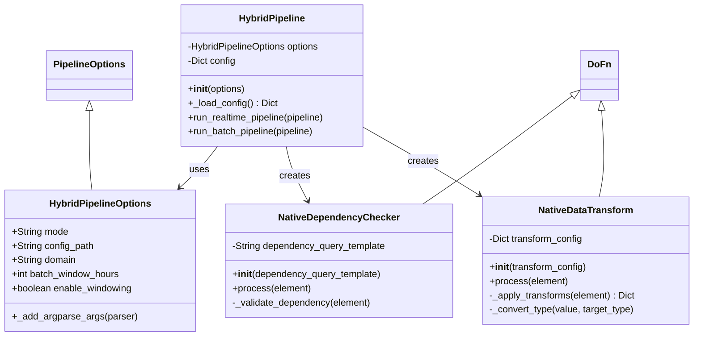

### 2. Reconciliation Pipeline Architecture

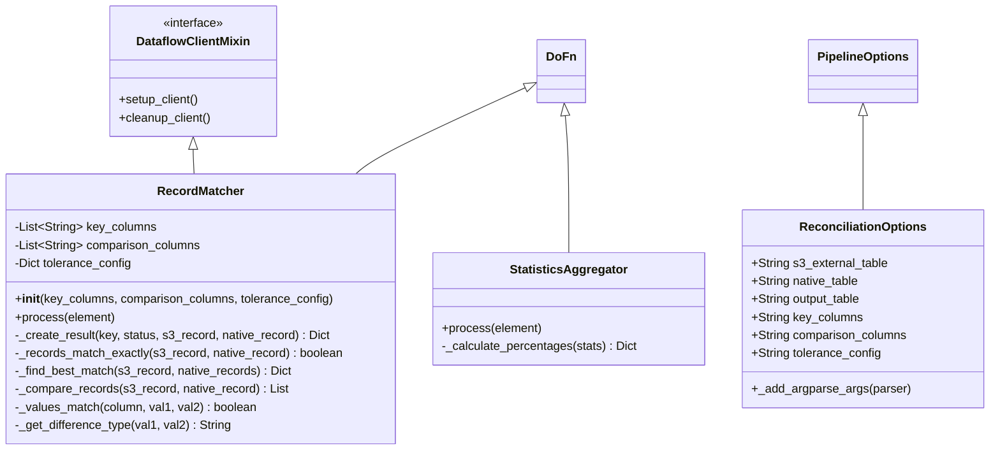

### 3. Data Distribution Architecture

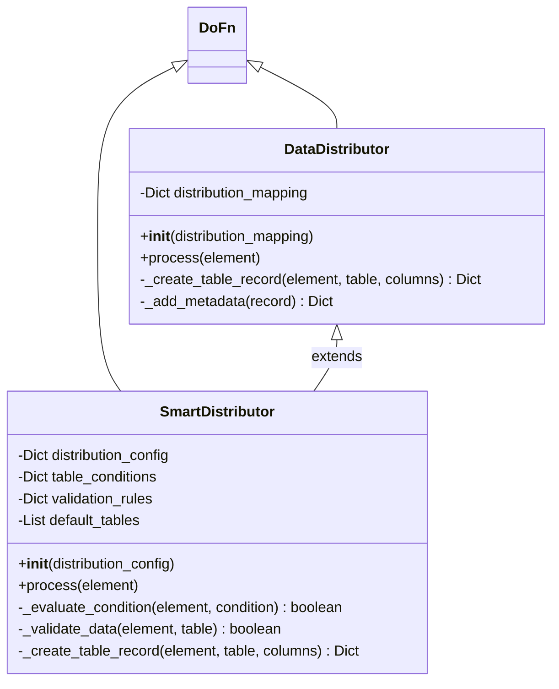

### 4. Dependency Checking Architecture

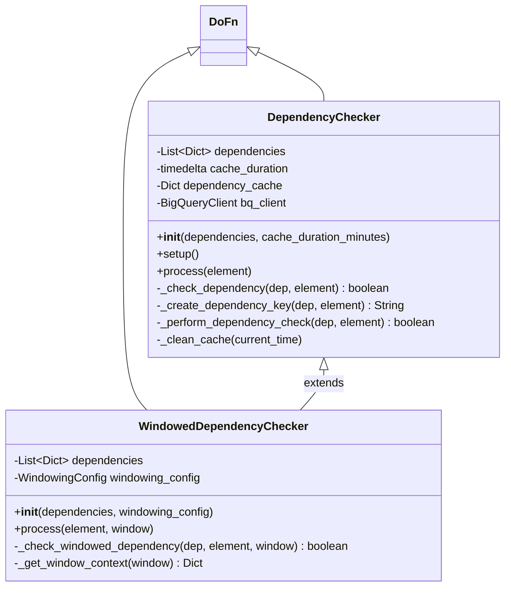

### 5. Windowing System Architecture

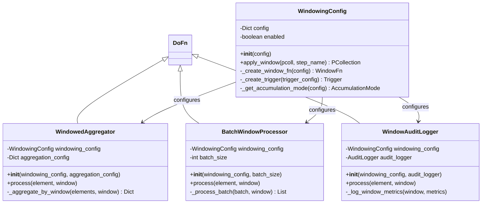

### 6. Audit & Monitoring Architecture

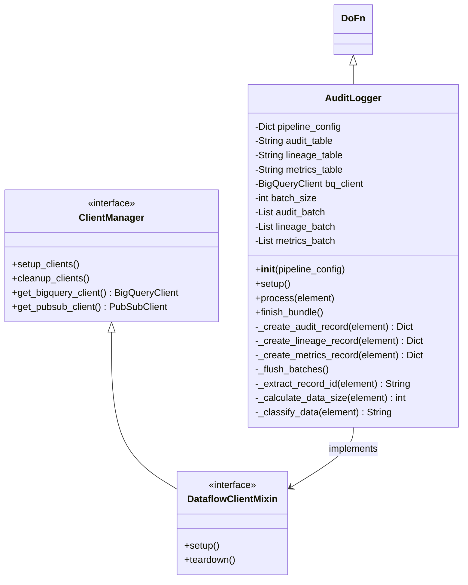

## 🔄 Sequence Diagrams

### 1. Hybrid Pipeline Execution Flow

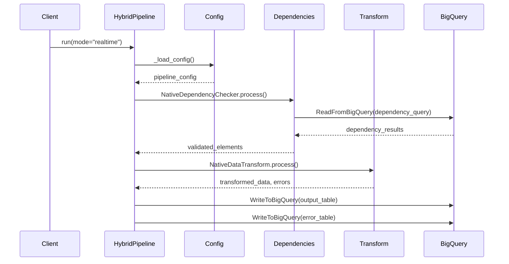

### 2. Reconciliation Pipeline Flow

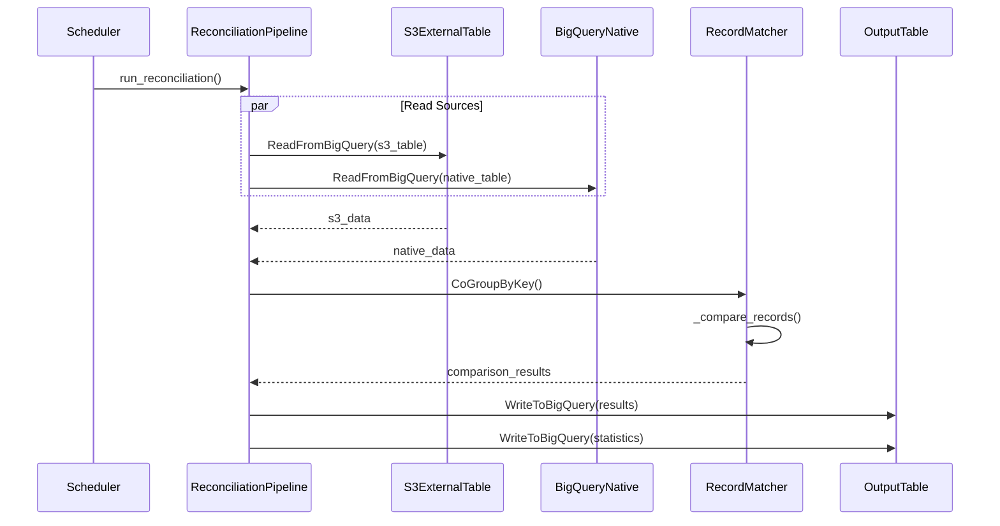

### 3. Data Distribution Flow

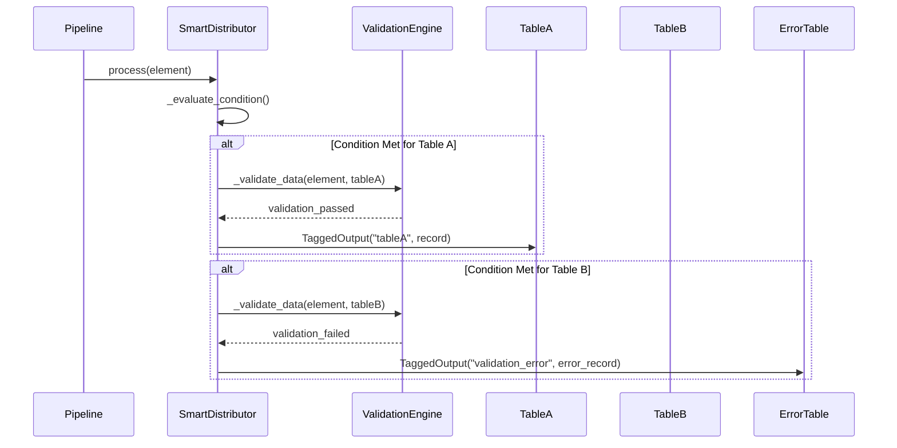

## 🎯 Component Interaction Patterns

### 1. Configuration Pattern
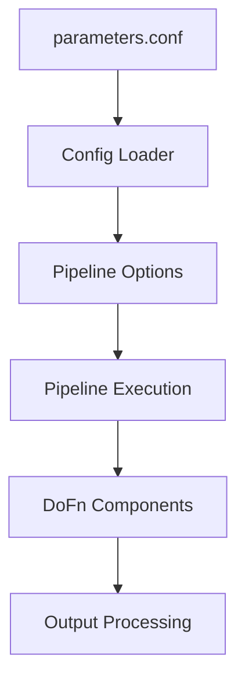

### 2. Error Handling Pattern
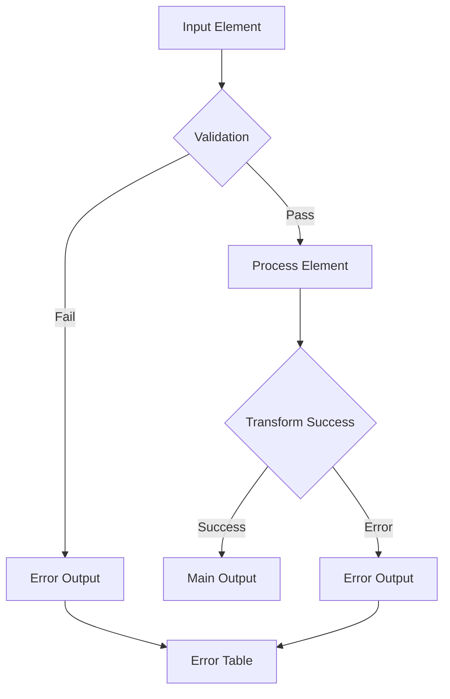

### 3. Audit Trail Pattern
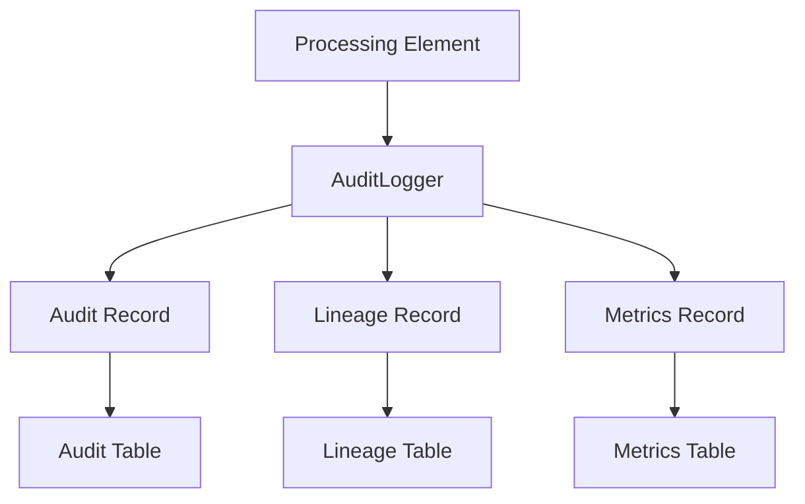

## 📐 Design Pattern Implementation

### 1. Strategy Pattern
- **Context**: Pipeline execution mode (batch/realtime)
- **Strategies**: Different processing algorithms
- **Benefits**: Runtime mode selection, code reuse

### 2. Template Method Pattern
- **Template**: Base pipeline structure
- **Variable Steps**: Transform logic, I/O operations
- **Benefits**: Consistent pipeline structure, customizable behavior

### 3. Factory Pattern
- **Products**: Window functions, triggers, configurations
- **Factories**: WindowingConfig, OptionsFactory
- **Benefits**: Object creation abstraction, runtime configuration

### 4. Observer Pattern
- **Subject**: Pipeline processing
- **Observers**: AuditLogger, MetricsCollector
- **Benefits**: Loose coupling, extensible monitoring

### 5. Decorator Pattern
- **Component**: Basic DoFn processing
- **Decorators**: Windowing, caching, validation
- **Benefits**: Behavior enhancement, composability

This comprehensive OOP design documentation provides clear understanding of the pipeline architecture, class relationships, and design patterns used throughout the codebase.
